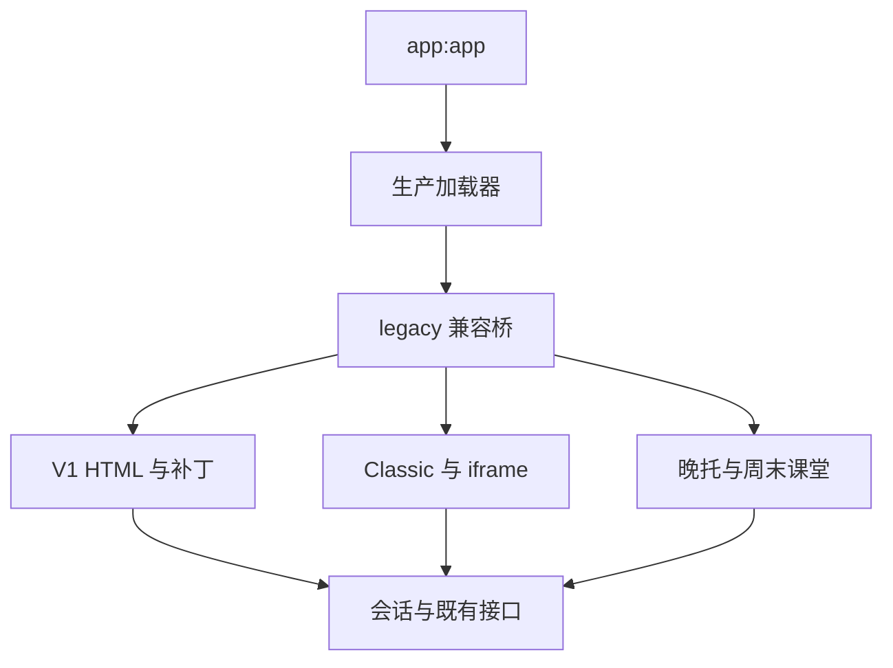

# 页面依赖

```mermaid
flowchart TD
  A["app:app"] --> B["生产加载器"]
  B --> C["legacy 兼容桥"]
  C --> D["V1 HTML 与补丁"]
  C --> E["Classic 与 iframe"]
  C --> F["晚托与周末课堂"]
  D --> G["会话与既有接口"]
  E --> G
  F --> G
```

V1 shell 动态挂载各角色的 DOM。兼容桥还装配原生页面、认证交接和最终 HTML 响应变体。知识地图、应试及部分教学资源依赖功能开关、原生入口或 Classic 工作区。周末课大屏由教师会话的 board 响应投影，学生练习另取学生侧接口。
